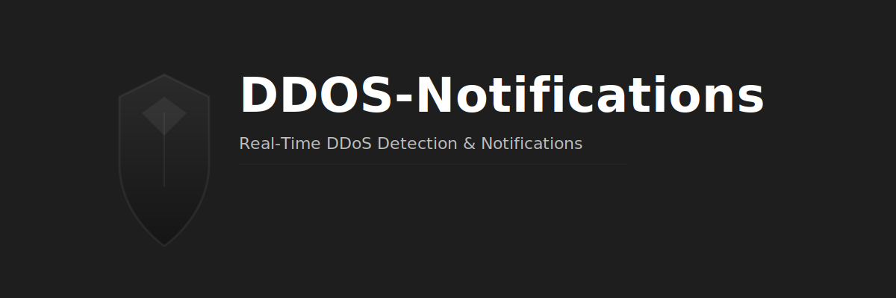
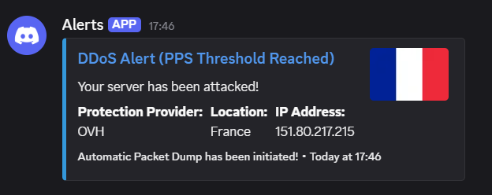

<p align="center">
  
</p>

<div align="center">

# 🚨 DDOS-Notifications  
**Real-Time DDoS Detection & Notifications**


</div>

---

## 🧠 Overview

**DDOS-Notifications** is a lightweight tool for **real-time detection of suspicious network spikes** and **instant alerting** through webhooks such as Discord.  
Perfect for sysadmins and security engineers who want quick alerts without complex monitoring setups.

---

## 📁 Project Structure

```
DDOS-Notifications/
├── dump.sh         # Bash script to collect network/log data
├── webhook.py      # Python script to check & send alerts
├── setup.txt       # Optional setup notes
└── README.md
```

---

## 📦 Installation & Setup Guide

Follow these steps to set up DDOS-Notifications on your server:

### Step 1: Install Dependencies

First, update your system and install the required packages: `tcpdump`, `python3`, `screen`, and `python3-pip`.

```bash
sudo apt update -y && sudo apt upgrade -y
sudo apt install python3-pip screen tcpdump -y
pip3 install discord-webhook pyyaml
```

### Step 2: Clone the Repository

Clone this repository to your server and navigate into the directory:

```bash
git clone https://github.com/JackCoates1/DDOS-Notifications.git
cd DDOS-Notifications
```

### Step 3: Configure the Tool

The tool uses a YAML configuration file for settings. Copy the example configuration and edit it with your own values:

```bash
cp config.yaml.example config.yaml
nano config.yaml  # or use vim, vi, etc.
```

**Edit the following values in `config.yaml`:**

- `webhook.url`: Your Discord webhook URL
- `webhook.username`: The bot username that will appear in Discord
- `embed.fields.protection_provider`: Your hosting/protection provider
- `embed.fields.location`: Your server location
- `embed.fields.ip_address`: Your server's IP address
- `embed.thumbnail_url`: URL to a flag or custom image for the alert

**Example configuration:**
```yaml
webhook:
  url: "https://discord.com/api/webhooks/YOUR_WEBHOOK_ID/YOUR_WEBHOOK_TOKEN"
  username: "DDoS Alert Bot"

embed:
  title: "DDoS Alert (PPS Threshold Reached)"
  url: "https://cybersniff.net"
  description: "Your server has been attacked!"
  color: 3447003
  
  footer_text: "Automatic Packet Dump has been initiated!"
  
  fields:
    protection_provider: "OVH"
    location: "France"
    ip_address: "151.80.217.215"
  
  thumbnail_url: "https://flaglane.com/download/french-flag/french-flag-medium.jpg"
```

### Step 4: Set Script Permissions

Make the `dump.sh` script executable:

```bash
chmod +x dump.sh
```

### Step 5: Troubleshooting the Network Interface

If you encounter an error like `arithmetic expression: expecting primary`, this means the script cannot find your network interface. 

**Find your network interface:**

```bash
ip addr
```

Look for your primary network interface (commonly `eth0`, `ens3`, `venet0`, or similar). Then update the `interface` variable in `dump.sh`:

```bash
nano dump.sh
```

Change line 7 from:
```bash
interface=venet0
```

To your actual interface name, for example:
```bash
interface=eth0
```

### Step 6: Running in the Background with `screen`

To keep the monitoring script running even after you disconnect from SSH, use `screen`.

**Create a new screen session:**

```bash
screen -S ddos-monitor
```

**Run the script inside the screen session:**

```bash
sudo ./dump.sh
```

You should see output like:
```
0 packets/s
15 packets/s
23 packets/s
```

**Detach from the screen session:**

Press `Ctrl+A`, then press `D` to detach. The script will continue running in the background.

**Re-attach to the session later:**

```bash
screen -r ddos-monitor
```

**List all screen sessions:**

```bash
screen -ls
```

---

## 🔔 Alert Example

When a DDoS attack is detected (traffic exceeds 750 packets/second), you'll receive an alert in Discord:



*Screenshot: Discord Webhook Alert showing attack details*

---

## 🧭 How It Works

```
+-------------+       +----------------+       +----------------------+
|  dump.sh    | --->  |  webhook.py    | --->  |  Webhook (Discord)   |
| (collects   |       | (checks &      |       +----------------------+
|  metrics)   |       |  sends alerts) |       
+-------------+       +----------------+
```

---

## 🌟 Roadmap

- [ ] YAML/JSON config support  
- [ ] Multiple notification channels (SMS, Telegram, Email)  
- [ ] Smarter detection (rolling averages / anomaly detection)  
- [ ] Optional dashboard view

---

## 🤝 Contributing

Contributions are welcome!

1. **Fork** the repository  
2. Create a new branch (`feature/your-feature`)  
3. Commit your changes  
4. Open a **Pull Request**

Ideas for contributions:
- Add new notification types
- Improve threshold detection logic
- Add tests or CI pipelines

---

## 📜 License

```
MIT License

Copyright (c) 2025

Permission is hereby granted, free of charge, to any person obtaining a copy
of this software and associated documentation files...
```

---

<p align="center">
  🛡 Built for security-minded admins • Fast • Simple • Effective
</p>

