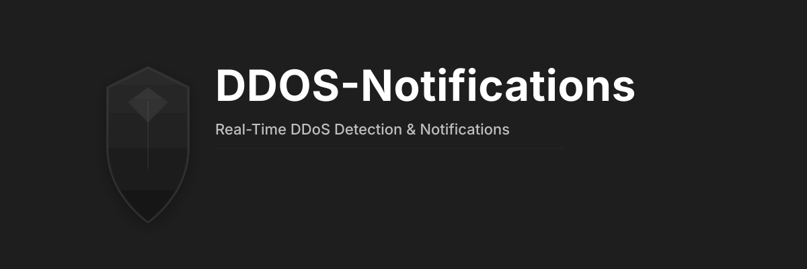
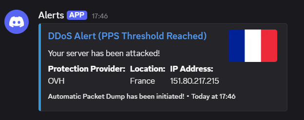

<p align="center">
  
</p>

<div align="center">

# DDOS-Notifications
**Real-Time DDoS Detection & Notifications**


</div>

---

## Overview

Lightweight Python tool that monitors network traffic and sends instant alerts to Discord when a potential DDoS is detected. Built it because I wanted something simple that just works without a massive monitoring stack.

---

## Project Structure

```
DDOS-Notifications/
├── dump.sh             # Collects network/packet data
├── webhook.py          # Checks thresholds, fires Discord alert
├── config.yaml.example # Copy this and fill in your values
└── README.md
```

---

## Setup

**1. Install dependencies**

```bash
sudo apt update && sudo apt install python3-pip screen tcpdump -y
pip3 install discord-webhook pyyaml
```

**2. Clone the repo**

```bash
git clone https://github.com/JackCoates1/DDOS-Notifications.git
cd DDOS-Notifications
```

**3. Configure**

```bash
cp config.yaml.example config.yaml
nano config.yaml
```

Set your Discord webhook URL, server IP, and location.

**4. Check your network interface**

```bash
ip addr
```

Update the `interface` variable in `dump.sh` if needed — common values are `eth0`, `ens3`, `venet0`.

**5. Run in background with screen**

```bash
chmod +x dump.sh
screen -S ddos-monitor
sudo ./dump.sh
# Ctrl+A, D to detach — screen -r ddos-monitor to re-attach
```

---

## How It Works

`dump.sh` monitors packet rate → `webhook.py` checks against threshold → Discord alert fires if exceeded.



---

## Roadmap

- [ ] Telegram + email support
- [ ] Rolling average detection to reduce false positives
- [ ] Optional web dashboard

---

MIT License
